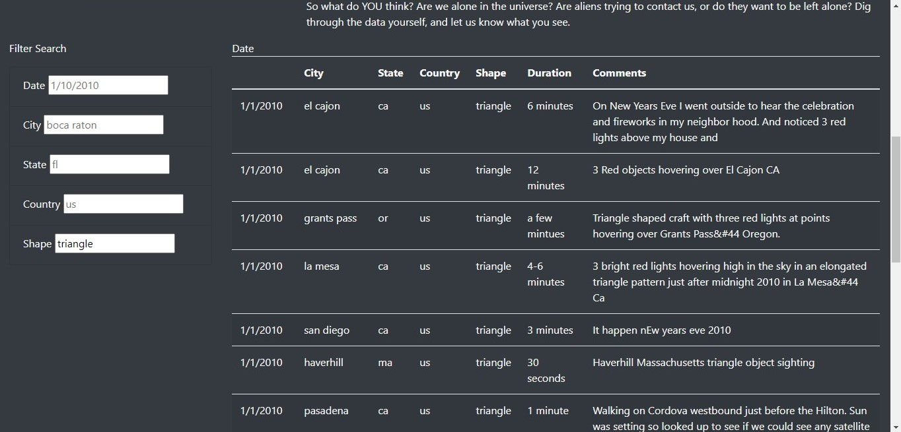

# UFOs: The Truth is Out There

## Overview

This project allows users to sort through UFO sighting data to decide for themselves: are UFOs fact or fiction?

## How It Works

To use this app on your own, please use the following steps:
 1. Download the repository onto your computer
 2. Copy the path for index.html into your web browser
 3. Type in anything you want to search for in the filter search box located at the bottom left of the page
 4. Press enter to view your results!

The following screenshot shows a filtered search for triangle shaped UFOs. After pressing enter, the results show up in a table on the bottom right side of the page.

## Summary

### Drawbacks 

The dataset used for this project is very limited and seems to only go through a few days of 2010.

### Recommendations 

*  For further development, more data could be added to allow users to filter through more than just 2010.
*  In the future, time could be spent developing a drop down list for shapes, states, etc so that users have a guide as to what they can search for.
